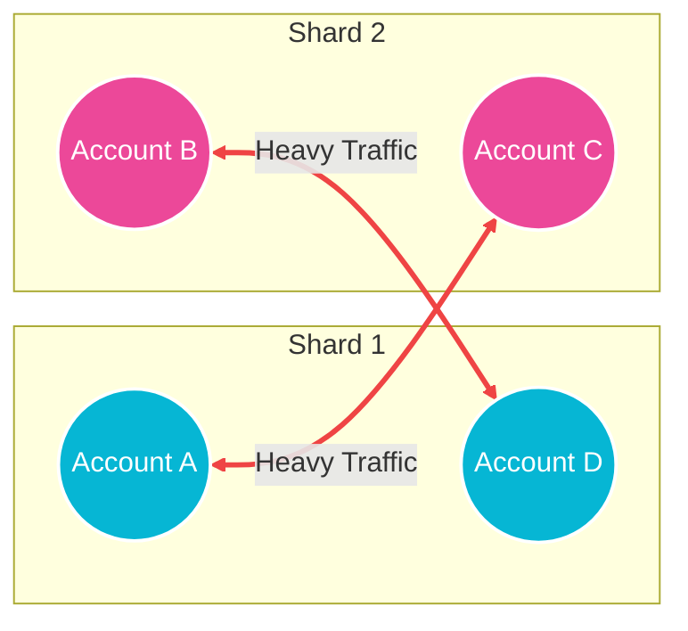
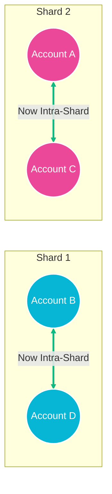
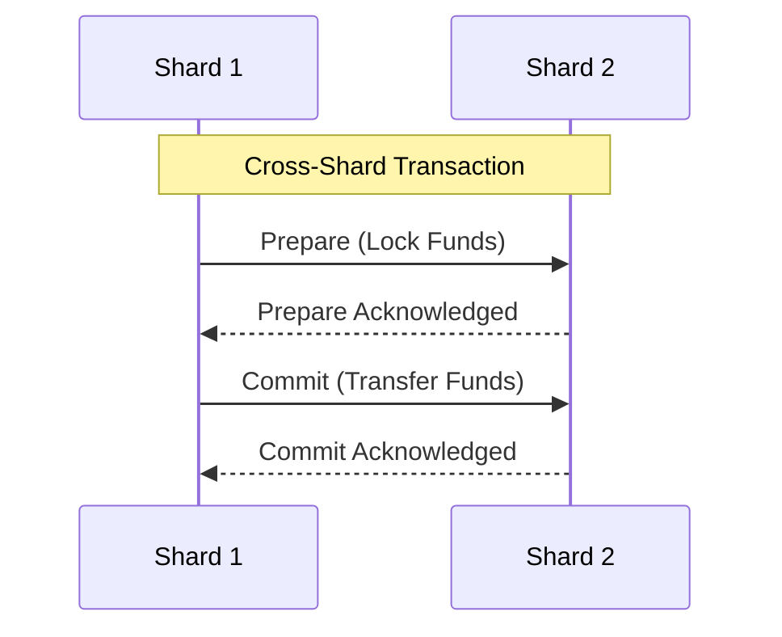

# Hybrid Consensus Protocol — Sharding Simulator

This project is an interactive, client-side web demonstration of a **network sharding algorithm** designed for blockchain systems. The goal of the algorithm is to partition a network of transacting accounts into smaller, parallel "shards" in a way that minimizes cross-shard communication, which is expensive and slow compared to local, intra-shard execution.

---

## 🧠 How the Algorithm Works (Visualized)

The core algorithm is an **Iterative Pairwise Swap**. It identifies accounts that frequently interact but are placed in different shards, and swaps them to bring them into the same shard, effectively turning expensive cross-shard traffic into cheap intra-shard traffic.

### 1. Initial State (Random Assignment)
Initially, accounts are randomly assigned to shards. Because strongly connected accounts might land in different shards, the network is flooded with expensive cross-shard transactions (red lines).



### 2. Evaluating a Swap
The algorithm evaluates pairs of nodes in different shards. It asks: *"If we swap Account A and Account B, what is the net reduction (gain) in cross-shard traffic weight?"*

If the gain is positive (meaning the swap eliminates more cross-shard traffic than it creates), the swap is executed.

### 3. Final State (Optimized Clusters)
By trading `Account A` and `Account B`, their respective heavy transaction pathways are now completely localized within their own shards. The red cross-shard edges become green intra-shard edges.



### 4. Two-Phase Commit Execution
Once the optimal mapping is found, transactions are executed. 
- **Intra-shard transactions** run in massive parallel instantly.
- **Cross-shard transactions** are bottlenecked by a Sequential Two-Phase Commit (2PC) between the two shards, inherently limiting network throughput and increasing latency. By minimizing these via our partition algorithm, overall network performance skyrockets.



---

## ⏱️ Time Complexity Breakdown

Let **$V$** be the number of nodes (accounts), **$E$** be the number of unique transaction edges, and **$T$** be the total number of transactions.

| Phase | Complexity | Description |
| :--- | :--- | :--- |
| **Graph Generation** | $\mathcal{O}(V + T)$ | Accounts and highly clustered synthetic transaction flows are generated into a hash map. |
| **Traffic Calculation** | $\mathcal{O}(E)$ | Iterates through unique edges to calculate total initial vs. cross-shard traffic weight. |
| **Iterative Swap (Per Step)** | $\mathcal{O}(V^2 \cdot E)$ | Evaluates every possible cross-shard node pair $\mathcal{O}(V^2)$. For each pair, it iterates through edges $\mathcal{O}(E)$ to calculate the exact traffic reduction gain. *(Note: In a production environment, checking only adjacency lists would optimize this to $\mathcal{O}(V \cdot E)$).* |
| **Total Partition Runtime** | $\mathcal{O}(S \cdot V^2 \cdot E)$ | The loop repeats for $S$ successful swaps until the network converges and no further positive-gain swaps can be found. |
| **Shard Rebalancing** | $\mathcal{O}(V \log V + V^2)$ | Nodes are sorted by degree to seamlessly pull low-activity nodes from overloaded shards to underloaded shards to maintain size fairness. |
| **Classification** | $\mathcal{O}(T)$ | Separates transactions into `Intra` vs `Cross` queues via $\mathcal{O}(1)$ shard mapping lookups. |

---

## 🚀 Running the Demo Locally

1. Install dependencies:
   ```bash
   npm install
   ```
2. Start the Vite development server:
   ```bash
   npm run dev
   ```
3. Open your browser and watch the algorithm optimize the network live!
