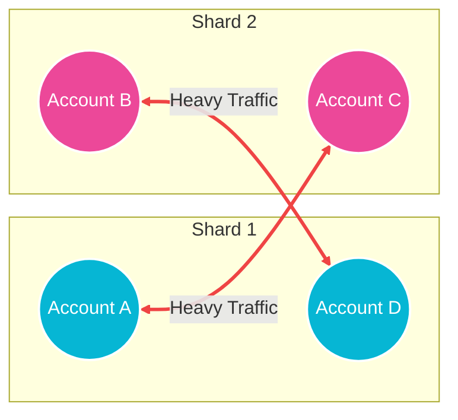
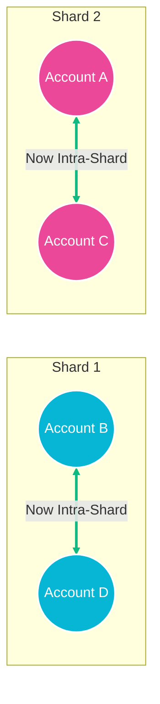
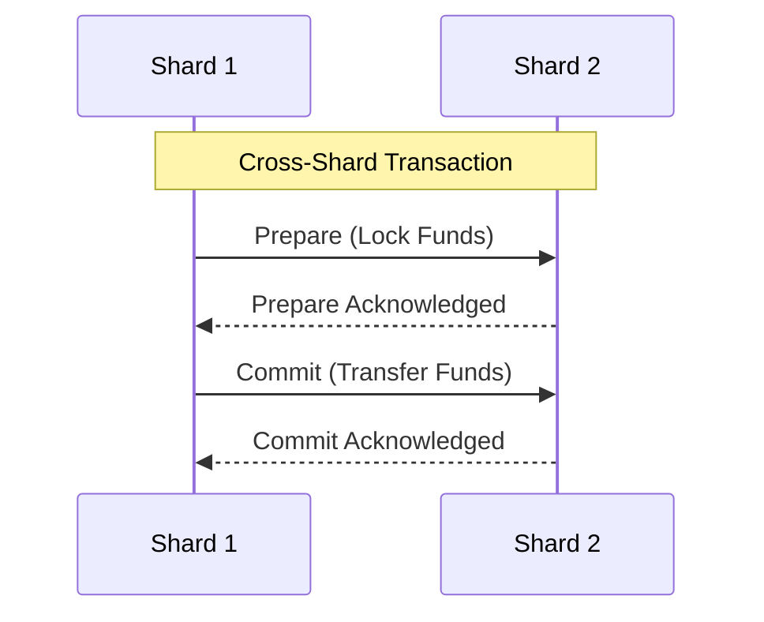
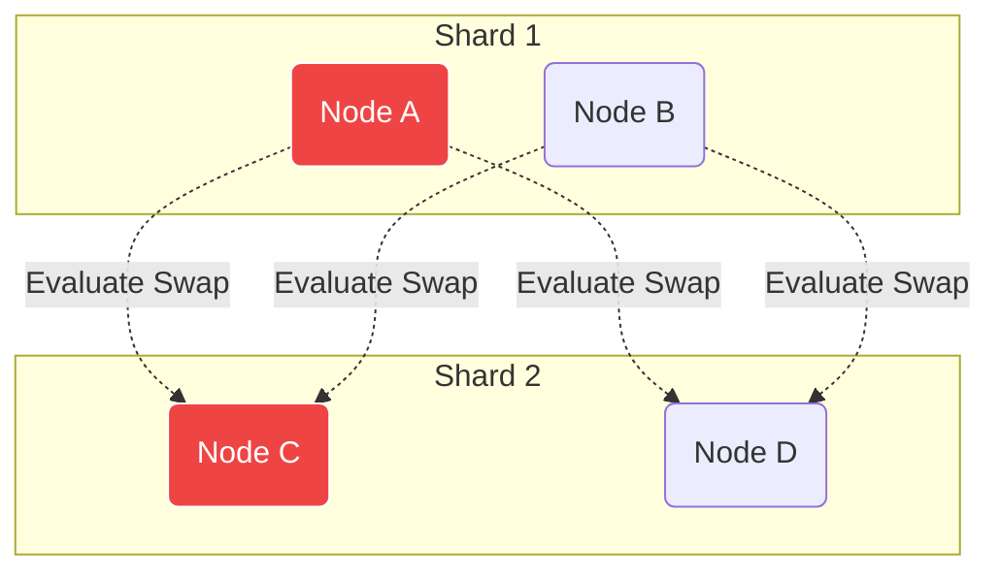
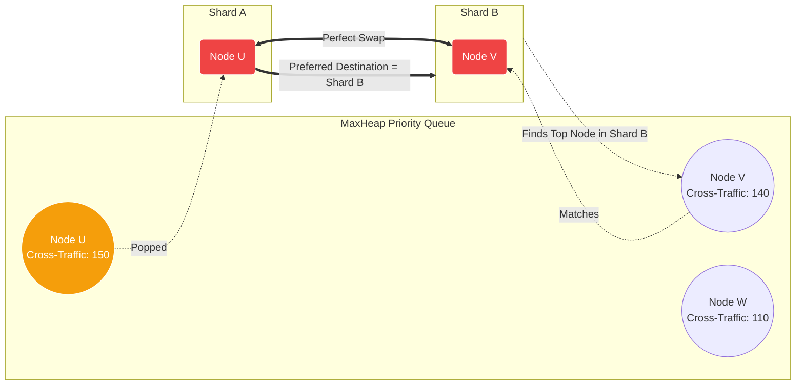

# Hybrid Consensus Protocol — Sharding Simulator

This project is an interactive, client-side web demonstration of a **network sharding algorithm** designed for blockchain systems. The goal of the algorithm is to partition a network of transacting accounts into smaller, parallel "shards" in a way that minimizes cross-shard communication, which is expensive and slow compared to local, intra-shard execution.

---

## 🧠 How the Algorithm Works (Visualized)

The core algorithm is an **Iterative Pairwise Swap**. It identifies accounts that frequently interact but are placed in different shards, and swaps them to bring them into the same shard, effectively turning expensive cross-shard traffic into cheap intra-shard traffic.

### 1. Initial State (Random Assignment)
Initially, accounts are randomly assigned to shards. Because strongly connected accounts might land in different shards, the network is flooded with expensive cross-shard transactions (red lines).



### 2. Evaluating a Swap
The algorithm evaluates pairs of nodes in different shards. It asks: *"If we swap Account A and Account B, what is the net reduction (gain) in cross-shard traffic weight?"*

If the gain is positive (meaning the swap eliminates more cross-shard traffic than it creates), the swap is executed.

### 3. Final State (Optimized Clusters)
By trading `Account A` and `Account B`, their respective heavy transaction pathways are now completely localized within their own shards. The red cross-shard edges become green intra-shard edges.



### 4. Two-Phase Commit Execution
Once the optimal mapping is found, transactions are executed. 
- **Intra-shard transactions** run in massive parallel instantly.
- **Cross-shard transactions** are bottlenecked by a Sequential Two-Phase Commit (2PC) between the two shards, inherently limiting network throughput and increasing latency. By minimizing these via our partition algorithm, overall network performance skyrockets.



---

## ⚡ The Evolution of Partitioning Algorithms

The simulator features a modular benchmarking engine that allows you to compare three distinct graph partitioning algorithms head-to-head on the exact same topology.

### Algorithm 1: Original (Brute Force)
The baseline method. It guarantees a highly optimized local minimum but is mathematically exhaustive.
- **Approach:** Evaluates **every possible cross-shard node pair** $\mathcal{O}(V^2)$. For each candidate pair, it scans **all** edges $\mathcal{O}(E)$ in the network to compute the exact net reduction in cross-shard traffic.
- **Complexity:** $\mathcal{O}(S \cdot V^2 \cdot E)$ (where $S$ is the number of successful swaps)



### Algorithm 2: Optimization 1 (Adjacency List)
A mathematical optimization of the brute force method that yields the exact same deterministic results but exponentially faster.
- **Approach:** Instead of scanning all edges $\mathcal{O}(E)$ to calculate the gain of swapping $u$ and $v$, it relies on a pre-computed Adjacency List. It strictly computes the delta of the direct neighbors of $u$ and $v$, reducing the gain calculation to $\mathcal{O}(deg(u) + deg(v))$.
- **Complexity:** $\mathcal{O}(S \cdot V \cdot E)$

### Algorithm 3: Optimization 2 (Priority Queue + Smart Heuristics)
A blazing fast, state-driven local search algorithm designed for massive scale. Instead of evaluating all pairs, it maintains a **MaxHeap Priority Queue** of the network's most heavily congested nodes.

- **Destination-Aware Matchmaking:** When a bottleneck node is popped from the queue, the algorithm mathematically determines its "preferred destination shard" (the shard it sends the most traffic to). It then explicitly cross-references the Priority Queue to find *other* highly congested nodes residing in that target shard, executing a perfectly matched swap.
- **Deeper Tabu Tolerance:** Because it computes candidate swaps so quickly, it can afford to execute up to 15 successive *negative gain* swaps (Simulated Annealing / Tabu Search) to intentionally climb out of deep mathematical craters, often finding significantly better global optimums than Brute Force.
- **Complexity:** $\mathcal{O}(S \cdot E \log V)$



---

## 🚀 Running the Demo Locally

1. Install dependencies:
   ```bash
   npm install
   ```
2. Start the Vite development server:
   ```bash
   npm run dev
   ```
3. Open your browser and watch the algorithm optimize the network live!
